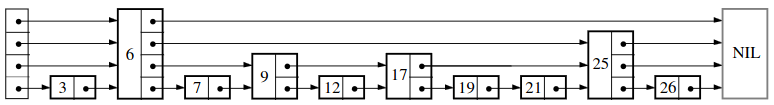
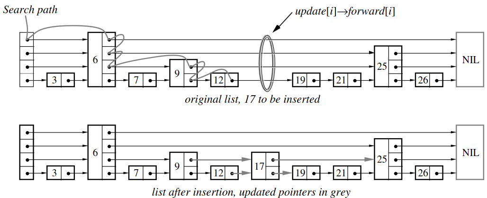

[](https://classroom.github.com/a/M7ynuwTX)
# Project 2 - Creating a Skip List
## Contents
1. [Introduction](#introduction)
2. [Source Code](#source-code)
3. [Given Code](#given-code)
4. [Reading The Javadoc](#reading-the-javadoc)
5. [Your Task](#your-task)
6. [Submit Your Work](#submit-your-work)
7. [Grading](#grading)
8. [Rubric](#rubric)
9. [Tips](#tips)

## Introduction
In this project you will build a Skip List and use that to track your Library data. The goal of this project is to get you in the Java Generics mindset and implement a simple data structure.

This is an individual project and is expected to be completed without any code-sharing between yourself and your classmates.

This project contributes 6.25% toward the final grade.

## Source Code
For this and all the later projects, you will be working on the baseline code that needs to be
downloaded from this Github repo. Furthermore, all projects will include a corresponding `javadoc` which you can read to aid you in your implementations. **Please make sure you read this whole section, as well as the [grading guidelines](#grading), before cloning the repo on Github.**

## Given Code
If you take a look at the current repo you’ll see that you’ve been given quite a bit of skeleton code to get you started on completing the project. This section is dedicated to giving a brief overview of the different classes that you’ll be using.

### OL_Library Class
The OL_Library object is identical to the Library you are already familiar with. I have provided a full implementation of the Library class so everyone is on the same playing field for this project.

### SL_Library Class
The SL_Library object is *nearly* identical to the OL_Library class. The only difference is that Skip Lists are used to collect the internal Library data.

### The OL/SL_Driver Classes
The OL/SL drivers exist to illustrate the complexity differences associated with using varying data structures. An example Library is constructed with 4096 Items (Books in this case, although none of that behaviour is utilized). Each program tries to grab an item with the maximum int value (0x7FFFFFFF), which would necissitate searching through to the end of the list, one million times. You should find SL_Driver runs *significantly* faster than OL_Driver when all is said and done. (On my machine it takes 14s for OL_Driver to finish and .3s for SL_Driver.)

The Drivers are there to help you get started testing out your code; it does not, however, contain every conceivable test that could be run. When the TAs test your code it will be done **with our own Driver file**.

### The Makefile
You've been provided a makefile that always compiles `OL_Driver.java`, `SL_Driver.java`, as well as all accompanying `java` files in the source code. When you are in the base directory, you can compile your files with a call to `make`; I have provided the `-g` flag so you can use jdb to debug any object and `-d` so all of the class files end up in a directory called "build". You can call `make clean -k` to remove all `class` files and temporary emacs files from your directories.

You may alter the makefile however you like, but there is no need to do so.

## Reading The Javadoc
Using `javadoc`, I have compiled a set of documentation that you can read to help provide you with direction on how certain methods should behave. Once you clone this repo you can easily read through the documentation by clicking on `index.html` and opening it in your browser of choice. Once you've done so, you can freely click around on the hyperlinks to view in finer and finer detail all of the packages, classes, and methods that should be implemented for the finished project.

## Your Task
- Implement a fully functional and generic Skip List. You'll need to read the `javadoc` for SkipList to see all of the methods that you are expected to provide. (The *p*-value should be .25.)

## Submit Your Work
Once your code is ready for grading, make sure you commit it to the Github Classroom Repo. **Any commits pushed after the deadline will be considered late submissions.**

Please also include a `PROJ1.txt` file explaining your experience working on this project.
- The status of your implementation (especially, if not fully complete).
- A description of how your code works, if that is not completely clear by reading the code (note that this should not be necessary, ideally your code should be self-documenting).
- Possibly a log of test cases which work and which don't work.
- Any other material you believe is relevant to the grading of your project.
**Suggestion**: Test your code thoroughly on a CS machine before submitting.

## Grading
The following are the general grading guidelines for this and all future projects.
- Late penalty is 30\% of the points scored for each of the first two days late, and will not be graded thereafter.
- If the submitted code cannot be successfully patched to the baseline source code, or the patched code does not compile:
  ```
  1	TA will try to fix the problem (for no more than 3 minutes);
  2	if (problem solved)
  3	  1%-10% points off (based on how complex the fix is, TA's discretion);
  4	else
  5	  TA may contact the student by email or schedule a demo to fix the problem;
  6	  if (problem solved)
  7	    11%-20% points off (based on how complex the fix is, TA's discretion);
  8	  else
  9	    All points off;

  ```
So in the case that TA contacts you to fix a problem, please respond to TA's email promptly or show up at the demo appointment on time; otherwise the line 9 above will be effective.
- If the code is not working as required in the project spec, the TA should take points based on the assigned full points of the task and the actual problem.
- Lastly but not the least, stick to the collaboration policy stated in the syllabus: you may discuss with your fellow students, but code should absolutely be kept private. You may not use any kind of generative AI to assist you. Any kind of cheating will result in zero points on the project, and further reporting.

## Rubric
- Code Compiles (20 Points)
- A baseline of 80 points is granted. All facets of the SkipList will be tested (insertion, deletion, key grabbing, etc.). Each failed check will result in -10 points.
- SkipList is not generic (-100 Points)
- The use of any built-in Java methods for creating lists or constructing any data structures whatsoever (-100 points)

## Tips
### Making the SkipList
The following image shows a Skip List:



The Skip List is a probabilistic Linked List-style alternative to using balanced trees. You can think of it as a Linked List where nodes have the ability to skip over other nodes. The skipping is achieved by each node storing an array of nodes where each element of the array is associated with a different "level" of the Skip List (recall that a regular Linked List would only need to store a single next pointer...this means a regular Linked List is a special case of the Skip List where the maximum level is 1). 

I have transcribed psuedocode implementations of the major Skip List methods written by William Pugh:
- Search
```
Search(list, searchKey)
  x := list→header
  // loop invariant: x→key < searchKey
  for i:= list→level downto 1 do
    while x→forward[i]→ < searchKey do
      x := x→forward[i]
      // x→key < searchKey ≤ x→forward[1]→key
      x := x→forward[1]
  if x→key = searchKey then return x→value
    else return failure
```
- Insert
```
Insert(list, searchKey, newValue)
  local update[1...MaxLevel]
  x := list→header
  for i := list→level downto 1 do
    while x→forward[i]→key < searchKey do
      x := x→forward[i]
    //x→key < searchKey ≤ x→forward[i]→key
    update[i] := x
  x := x→forward[1]
  if x→key = searchKey then x→value := newValue
  else
    lvl := randomLevel()
    if lvl > list→level then
      for i := list→level + 1 to lvl do
        update[i] := list→header
      list→level := lvl
    x := makeNode(lvl, searchKey, newValue)
    for i := 1 to level do
      x→forward[i] := update[i]→forward[i]
      update[i]→forward[i] := x
```
In case it seems a bit abstract, here is an image of what insertion looks like:



- Delete
```
Delete(list, searchKey)
  local update[1...MaxLevel]
  x := list→header
  for i := list→level downto 1 do
    while x→forward[i]→key < searchKey do
      x := x→forward[i]
    update[i] := x
  x := x→forward[1]
  if x→key = searchKey then
    for i := 1 to list→level do
      if update[i]→forward[i] ≠ x then break
      update[i]→forward[i] := x→forward[i]
    free(x)
    while list→level > 1 and list→header→forward[list→level] = NIL do
      list→level := list→level - 1
```
- randomLevel
```
randomLevel()
  lvl := 1
  //random() that returns a random value in [0..1)
  while random() < p and lvl < MaxLevel do
    lvl := lvl + 1
  return lvl
```

If you would like to read more about Skip Lists then I suggest you take a look at [this paper](https://15721.courses.cs.cmu.edu/spring2018/papers/08-oltpindexes1/pugh-skiplists-cacm1990.pdf) by William Pugh (the inventor of the Skip List).

### How to Generate a Random Number
It's rather simple to do so in Java. I suggest you make use of Java's [Random](https://docs.oracle.com/en%2Fjava%2Fjavase%2F22%2Fdocs%2Fapi%2F%2F/java.base/java/util/Random.html) class. You can instantiate a new Random object and use its instance method [nextDouble](https://docs.oracle.com/en%2Fjava%2Fjavase%2F22%2Fdocs%2Fapi%2F%2F/java.base/java/util/Random.html#nextDouble()) to generate a number between 0.0 and 1.0.
